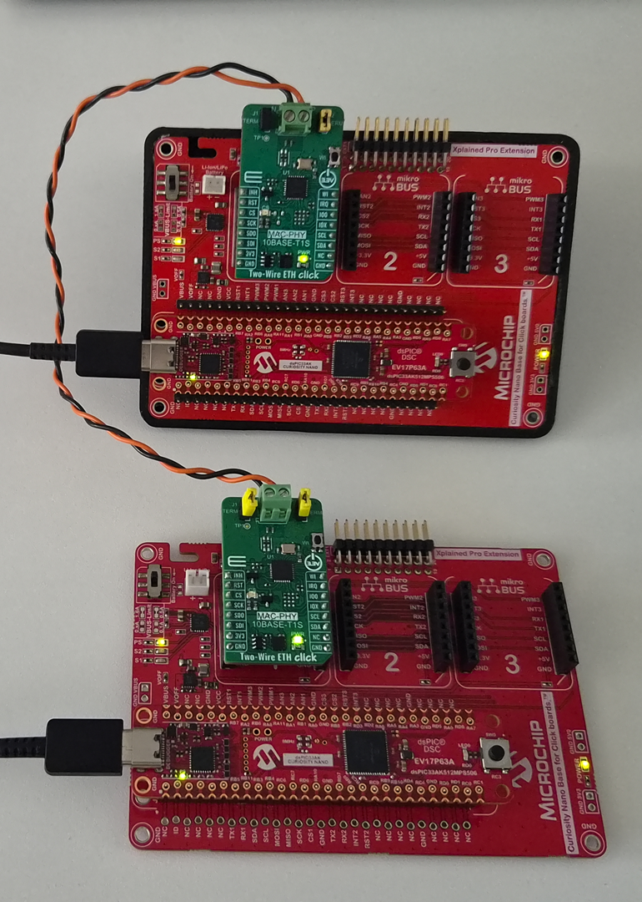

# dsPIC33AK512MPS506 Curiosity - 10BASE-T1S Heartbeat Demo

**Two-board LED synchronization and throughput testing over 10BASE-T1S Single Pair Ethernet**


---



### Development Tools

| Board / Module | Description | Link |
|----------------|-------------|------|
| dsPIC33AK512MPS506 Curiosity | Main development board (x2) | [Microchip DevTools](https://www.microchip.com/en-us/development-tool/ev17p63a) |
| Curiosity Nano Base for Click | Base platform for Click modules | [Microchip DevTools](https://www.microchip.com/en-us/development-tool/AC164162) |
| MIKROE-5543 | 10BASE-T1S Click board (LAN8651) | [MikroE](https://www.mikroe.com/eth-t1s-click) |

---

## Table of Contents

- [About](#about)
- [Features](#features)
- [Hardware](#hardware)
- [Network Configuration](#network-configuration)
- [Protocol Design](#protocol-design)
- [Timing Diagram](#timing-diagram)
- [Packet Size Analysis](#packet-size-analysis)
- [Performance Results](#performance-results)
- [Usage](#usage)
- [Build](#build)
- [Project Structure](#project-structure)
- [License](#license)

---

## About

This project demonstrates real-time LED synchronization between two dsPIC33AK512MPS506 Curiosity boards connected via 10BASE-T1S (Single Pair Ethernet). A single firmware image runs on both boards - the role (server or client) is selected by holding the button during reset.

The server board blinks its LED at 500ms intervals and sends a heartbeat to the client using two alternating transport modes:

1. **UDP Heartbeat** (lwIP stack): Standard UDP/IP packet via lwIP - demonstrates conventional networking
2. **Raw Ethernet Heartbeat** (zero-copy): Custom EtherType 0x88B5 frame sent directly via TC6 - bypasses the entire lwIP IP/UDP stack for minimum latency

The system alternates between modes every 10 exchanges, printing per-exchange RTT measurements to demonstrate the latency improvement of raw Ethernet over UDP on the same physical link.

An iperf-style UDP throughput test is also included for bandwidth measurement between the two boards.

---

## Features

- **Single firmware** for both boards - role selected at boot via button
- **Dual-mode heartbeat** alternating between UDP and raw Ethernet every 10 exchanges
- **Raw Ethernet heartbeat** achieving ~422 us RTT (bypasses lwIP entirely)
- **UDP heartbeat** achieving ~478 us RTT (standard lwIP UDP/IP path)
- **LED synchronization** over 10BASE-T1S using PLCA
- **Per-exchange RTT reporting** with 10ns resolution
- **UDP throughput test** (iperf) achieving ~9.5 Mbps board-to-board
- **Long-press reset** with visual feedback for role switching

---

## Hardware

| Component | Description |
|-----------|-------------|
| MCU | dsPIC33AK512MPS506 @ 200 MHz |
| Board | Curiosity Development Board |
| MAC-PHY | LAN8651 (10BASE-T1S with PLCA) |
| Interface | SPI @ 20 MHz (MCU to MAC-PHY) |
| LED | LED0 (active-low) |
| Switch | SW0 (active-low, with debounce) |

---

## Network Configuration

| Parameter | Server | Client |
|-----------|--------|--------|
| PLCA Node ID | 1 | 0 (coordinator) |
| IP Address | 192.168.0.101 | 192.168.0.100 |
| PLCA Node Count | 2 | 2 |
| Role Selection | Button NOT pressed at reset | Button held at reset |

---

## Protocol Design

### Dual-Mode Heartbeat (alternates every 10 exchanges)

The server controls the mode. The client is fully reactive -- it responds in whatever protocol it receives.

#### Mode 1: UDP Heartbeat (Port 5000)

```
SERVER                              CLIENT
  |                                    |
  |--- [UDP: 1 byte LED state] ------>|  (IP + UDP + 1B payload)
  |                                    |  Client updates LED
  |<-- [UDP: 1 byte 0xAC] -----------|  (IP + UDP + 1B ACK)
  |                                    |
  | RTT = time(ACK rx) - time(HB tx)  |
  |       ~478 us @ 20 MHz SPI        |
```

#### Mode 2: Raw Ethernet Heartbeat (EtherType 0x88B5)

```
SERVER                              CLIENT
  |                                    |
  |--- [ETH: 1 byte LED state] ------>|  (Eth header + 1B payload, no IP/UDP)
  |                                    |  Client updates LED
  |<-- [ETH: 1 byte 0xAC] -----------|  (Eth header + 1B ACK)
  |                                    |
  | RTT = time(ACK rx) - time(HB tx)  |
  |       ~422 us @ 20 MHz SPI        |
```

#### Mode Switching

```
[10x UDP] --> switch --> [10x ETH] --> switch --> [10x UDP] --> ...
```

### iperf Throughput Test (UDP Port 5001)

```
SERVER                              CLIENT
  |                                    |
  |--- [1460 bytes] ----------------->|
  |--- [1460 bytes] ----------------->|  Continuous UDP flood
  |--- [1460 bytes] ----------------->|
  |          ...                       |
  |                                    |  Client reports RX bandwidth
```

---

## Timing Diagram

### UDP Heartbeat (~478 us RTT)

```
     SERVER                    T1S Wire                    CLIENT
┌──────────────┐          ┌──────────────┐          ┌──────────────┐
│ Toggle LED   │          │              │          │              │
│ Record t0    │          │              │          │              │
│              │          │              │          │              │
│ SPI TX ──────┼──~65us──>│              │          │              │
│ (43B frame)  │          │ PLCA+Wire ───┼──~35us──>│              │
│              │          │              │          │ SPI RX ~65us │
│              │          │              │          │ lwIP process │
│              │          │              │          │ IP+UDP parse │
│              │          │              │          │ Update LED   │
│              │          │              │          │ Alloc pbuf   │
│              │          │              │          │ Build IP+UDP │
│              │          │              │          │ SPI TX ──────┼──~65us──┐
│              │          │              │<─~35us───┼─ PLCA+Wire   │         │
│ SPI RX <─────┼──~65us──┤              │          │              │         │
│ Record t1    │          │              │          │              │         │
│ RTT = ~478us │          │              │          │              │         │
└──────────────┘          └──────────────┘          └──────────────┘
```

### Raw Ethernet Heartbeat (~422 us RTT)

```
     SERVER                    T1S Wire                    CLIENT
┌──────────────┐          ┌──────────────┐          ┌──────────────┐
│ Toggle LED   │          │              │          │              │
│ Record t0    │          │              │          │              │
│              │          │              │          │              │
│ TC6 raw TX ──┼──~65us──>│              │          │              │
│ (15B frame)  │          │ PLCA+Wire ───┼──~35us──>│              │
│              │          │              │          │ SPI RX ~65us │
│              │          │              │          │ RX callback  │
│ NO lwIP ──── │          │              │          │ (no lwIP!)   │
│              │          │              │          │ Update LED   │
│              │          │              │          │ TC6 raw TX ──┼──~65us──┐
│              │          │              │<─~35us───┼─ PLCA+Wire   │         │
│ SPI RX <─────┼──~65us──┤              │          │              │         │
│ RX callback  │          │              │          │              │         │
│ RTT = ~422us │          │              │          │              │         │
└──────────────┘          └──────────────┘          └──────────────┘

    Savings vs UDP: ~56 us (no IP/UDP header build, no pbuf alloc,
                            no checksum, no stack demux)
```

---

## Packet Size Analysis

### UDP Heartbeat Packet (Server → Client)

| Layer | Field | Bytes |
|-------|-------|-------|
| Ethernet | Preamble + SFD | 8 |
| Ethernet | Destination MAC | 6 |
| Ethernet | Source MAC | 6 |
| Ethernet | EtherType (0x0800) | 2 |
| IP | Header | 20 |
| UDP | Header | 8 |
| **Application** | **LED state (payload)** | **1** |
| Ethernet | Padding (to 46B min payload) | 17 |
| Ethernet | FCS | 4 |
| **Total on wire** | | **72 bytes** |

### Raw Ethernet Heartbeat Packet (Server → Client)

| Layer | Field | Bytes |
|-------|-------|-------|
| Ethernet | Preamble + SFD | 8 |
| Ethernet | Destination MAC (broadcast) | 6 |
| Ethernet | Source MAC | 6 |
| Ethernet | EtherType (0x88B5) | 2 |
| **Application** | **LED state (payload)** | **1** |
| Ethernet | Padding (to 46B min payload) | 45 |
| Ethernet | FCS | 4 |
| **Total on wire** | | **72 bytes** |

### Comparison: MCU-Constructed Bytes

| Mode | MCU Builds | Sent over SPI | On Wire |
|------|-----------|---------------|---------|
| **UDP** | 14 (Eth) + 20 (IP) + 8 (UDP) + 1 = **43 bytes** | 43 bytes | 72 bytes |
| **Raw ETH** | 14 (Eth) + 1 = **15 bytes** | 15 bytes | 72 bytes |
| **Difference** | **28 fewer bytes** (no IP/UDP) | 28 fewer | Same (MAC pads) |

Both modes transmit the same 72 bytes on the wire due to Ethernet minimum frame padding. The RTT improvement comes from:
- 28 fewer bytes over SPI (~15 us at 20 MHz)
- No lwIP processing: pbuf alloc/free, IP routing, UDP checksum, stack demux (~41 us)

### iperf Packet (Throughput Test)

| Layer | Field | Bytes |
|-------|-------|-------|
| Ethernet | Preamble + SFD | 8 |
| Ethernet | Destination MAC | 6 |
| Ethernet | Source MAC | 6 |
| Ethernet | EtherType | 2 |
| IP | Header | 20 |
| UDP | Header | 8 |
| **Application** | **iperf data** | **1460** |
| Ethernet | FCS | 4 |
| **Total on wire** | | **1514 bytes** |

---

## Performance Results

| Metric | UDP Mode | Raw ETH Mode |
|--------|----------|--------------|
| Heartbeat RTT | ~478 us | ~422 us |
| RTT Jitter | ±5 us | ±5 us |
| Improvement vs UDP | -- | **~56 us (12%)** |

| Metric | Value |
|--------|-------|
| SPI Clock | 20 MHz |
| Heartbeat Rate | 2 Hz (500ms period) |
| Exchanges per mode | 10 |
| iperf Throughput | ~9.5 Mbps (95% link utilization) |
| PLCA Nodes | 2 |
| Timer Resolution | 10 ns |

---

## Usage

### Role Selection at Boot

1. **SERVER**: Power on the board normally (no button press)
2. **CLIENT**: Hold SW0 while powering on / resetting the board

### Normal Operation

| Action | Server | Client |
|--------|--------|--------|
| LED behavior | Blinks at 500ms | Mirrors server LED |
| Heartbeat mode | Alternates UDP/ETH every 10 exchanges | Reactive (responds in same protocol) |
| Short press SW0 | Start/stop iperf | No action |
| Long press SW0 (3s) | LED solid ON → release → reset in 1s | Same |
| UART output | Per-exchange RTT with mode label | Throughput stats when receiving iperf |

### Reset & Role Change

1. Hold SW0 for 3 seconds → LED turns ON solid
2. Release → "Resetting in 1s..." message
3. During that 1 second: hold SW0 for CLIENT, or leave released for SERVER
4. Board resets and boots into selected role

### UART Output Examples

**Server (dual-mode heartbeat):**
```
=== dsPIC33AK512MPS506 Curiosity + T1S ===
Role: SERVER (nodeId=1, IP=192.168.0.101)
  LED blinks at 500ms, heartbeat sent to client
  Short press: toggle iperf | Long press (3s): reset
Heartbeat: initialized as SERVER (peer=192.168.0.100)
ETH: initialized as SERVER (raw EtherType=0x88B5)
>> Switching to RAW ETH heartbeat
ETH: tx=1 rx=1 RTT=422 us (avg=422 us)
ETH: tx=2 rx=2 RTT=417 us (avg=419 us)
ETH: tx=3 rx=3 RTT=431 us (avg=423 us)
ETH: tx=4 rx=4 RTT=422 us (avg=423 us)
ETH: tx=5 rx=5 RTT=427 us (avg=424 us)
ETH: tx=6 rx=6 RTT=422 us (avg=423 us)
ETH: tx=7 rx=7 RTT=423 us (avg=423 us)
ETH: tx=8 rx=8 RTT=417 us (avg=422 us)
ETH: tx=9 rx=9 RTT=427 us (avg=423 us)
>> Switching to UDP heartbeat
UDP: tx=10 rx=10 RTT=481 us (avg=481 us)
UDP: tx=11 rx=11 RTT=482 us (avg=481 us)
UDP: tx=12 rx=12 RTT=478 us (avg=480 us)
UDP: tx=13 rx=13 RTT=477 us (avg=479 us)
UDP: tx=14 rx=14 RTT=478 us (avg=479 us)
UDP: tx=15 rx=15 RTT=477 us (avg=479 us)
UDP: tx=16 rx=16 RTT=480 us (avg=479 us)
UDP: tx=17 rx=17 RTT=477 us (avg=479 us)
UDP: tx=18 rx=18 RTT=482 us (avg=479 us)
>> Switching to RAW ETH heartbeat
...
```

**Client (receiving iperf):**
```
=== dsPIC33AK512MPS506 Curiosity + T1S ===
Role: CLIENT (nodeId=0, IP=192.168.0.100)
  LED mirrors server heartbeat
  Short press: toggle iperf | Long press (3s): reset
Heartbeat: initialized as CLIENT (peer=192.168.0.101)
ETH: initialized as CLIENT (raw EtherType=0x88B5)
IPERF RX bandwidth=9470 kbit/s packets=810 1/s
```

---

## Build

### Prerequisites

| Tool | Version |
|------|---------|
| MPLAB X IDE | v6.30+ |
| XC-DSC Compiler | v4.00+ |
| dsPIC33AK-MP DFP | 1.4.260+ |

### Build Steps

1. Open the project in VS Code with MPLAB extension
2. Select configuration: `dspic33AK_curiosity_T1S / default`
3. Build (F7 or MPLAB extension build button)
4. Program both boards with the same `out/dspic33AK_curiosity_T1S/default.elf`

---

## Project Structure

| Path | Purpose |
|------|---------|
| `src/main.c` | Main application, role selection, heartbeat mode switching |
| `src/app.c/.h` | Button debounce, long-press detection, boot role check |
| `src/T1S/udp_heartbeat.c/.h` | UDP heartbeat protocol (lwIP UDP/IP, 1-byte LED sync + RTT) |
| `src/T1S/eth_heartbeat.c/.h` | Raw Ethernet heartbeat (EtherType 0x88B5, bypasses lwIP) |
| `src/T1S/udp_perf_client.c/.h` | iperf UDP throughput test (sender + receiver) |
| `src/T1S/t1s_lwip.c/.h` | T1S/PLCA/lwIP initialization with configurable nodeId/IP |
| `src/T1S/tc6-lwip.c/.h` | TC6-lwIP bridge, raw RX callback registration |
| `src/systick/systick.c/.h` | Free-running 32-bit timer (10ns resolution, no ISR) |
| `src/hal/` | Hardware abstraction (SPI DMA, systick HAL, T1S HAL) |

| `cmake/` | CMake build system (auto-generated by MPLAB) |
| `libs/` | Pre-compiled libraries (lwIP, TC6) |
| `assets/` | Documentation diagrams (drawio) and images |

---

## License

Copyright (c) 2026 Microchip Technology Inc. and its subsidiaries. All rights reserved.

Subject to your compliance with these terms, you may use Microchip software and any derivatives exclusively with Microchip products.
